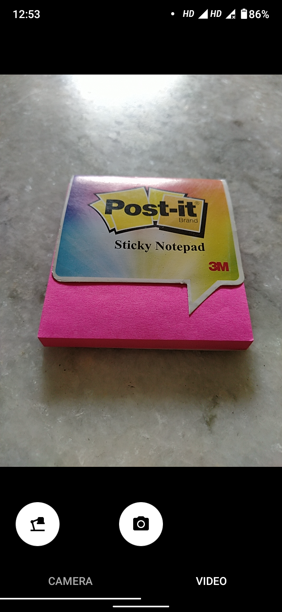

# Custom Camera App
A Custom Camera Android App made with the help of Camera2API.

The App has following functionalities:  
    1. Image Capture  
    

        
        
    

    2. Video Capture  
    3. Recycler View and Fragments use for toggling mode by swiping.  
    
